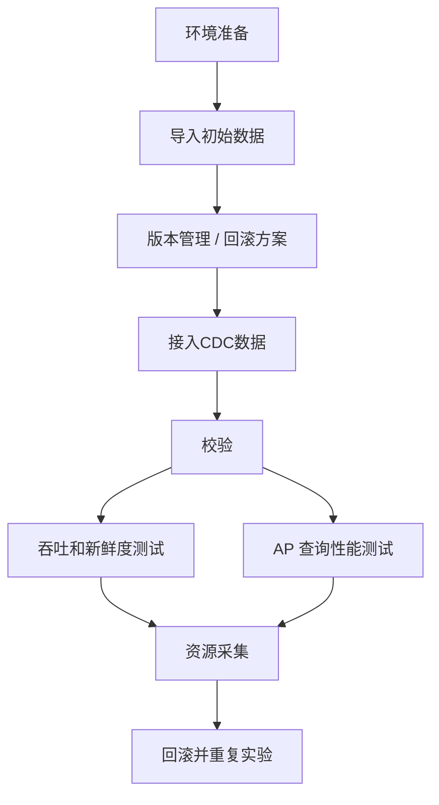

# 湖仓系统标准测试模板

本文档用于指导“接入一个新的湖仓系统时，需要做什么测试准备、验证和记录”。


先建立一条可重复的标准流程：



---

## 1. 环境准备

先明确新系统最小可运行的依赖栈
需要确认：
- 存储层：本地磁盘、S3等
- Catalog / Metastore：是否需要 Hive Metastore、JDBC Catalog、自定义 catalog
- 查询层：接入Trino
- 写入层：CDC 接入方式：Pixels-Sink、Flink、Spark等
- 运行环境：Java / Python / Spark / Flink / SDK 版本
- 监控工具：`top`、`htop`、`pidstat`、日志采样脚本

---

## 2. 导入初始数据

先证明“能建表、能导入、能查询”

建议流程：

1. 准备小规模样本数据，优先做功能验证
2. 建表并确认 schema
3. 导入 CSV / Parquet / 已有业务表数据
4. 用查询引擎验证表可读

需要记录：

- DDL
- 导入脚本
- 数据路径
- 功能验证 SQL

---

## 3. 版本管理与回滚方案

每轮实验前必须先定义“如何恢复到干净状态”。

至少要明确下面的一个或多个：

- 目标表路径如何清理
- checkpoint / state 路径如何清理
- 对象存储数据如何备份与回滚
- 每轮实验如何记录当前版本、路径和时间戳

建议记录字段：

- system
- dataset
- target path
- checkpoint path
- catalog / metastore
- table version / snapshot / log version
- experiment time

---

## 4. 接入CDC

外部变更如何进入新湖仓系统？

需要明确：

- 数据来源：RPC、proto文件、消息队列
- 主键从哪里来
- schema 从哪里来
- `insert / update / delete` 如何映射到目标系统
- 写入模式是 `append`、`merge`、`upsert`、`delete` 还是 compaction 驱动

建议固定一条标准流程：

1. 拉取增量数据
2. 做 schema / 主键对齐
3. 调用目标系统写接口
4. 输出本轮写入日志与计数

---

## 5. 正确性校验

在完成上面流程之后确定：

1. 目标表是否可读
2. schema 是否符合预期
3. 主键是否重复
4. delete 语义是否符合当前模式
5. update 后当前态是否正确
6. Trino（或者其他提供JDBC的查询引擎）能否正常跑AP查询

建议固定 acceptance checklist：

- `row_count`
- `distinct_pk_count`
- 是否存在重复主键
- 是否存在异常空值
- freshness 字段是否正常推进

---

## 6. 吞吐与新鲜度测试

指标：
- records/sec
- 端到端 freshness 延迟
- 不同 batch size / trigger mode / 并发度下的变化

测试时应同时记录：

- 输入规模，数据规模，benchmark类型
- batch size
- 更新速率 （Pixels-Sink log）
- 新鲜度（Pixels-Sink log）
- 是否开启 compaction / checkpoint / merge
- etc...

---

## 7. AP 查询性能测试

1. 先在更新前的静态数据上用Trino执行查询测试，获得static数据
2. 更新1%后，再进行查询。建议重复多次
---

## 8. 资源采集

每轮实验建议同步采：
- CPU
- 内存
- IO
- 网络（监控某个网卡的流量、S3的请求次数）
- driver / executor / query engine / metastore 日志

最小采样方式：

```bash
top
htop
pidstat -r -u -d 1
```

- `iostat`
- `vmstat`
- `perf`

---

## 9. 每次接入新湖仓系统的最小清单

可以直接按这个顺序推进：

1. 搭环境并跑通最小 demo
2. 完成建表、导入和查询验证
3. 设计实验目录、checkpoint 和回滚策略
4. 接上CDC
5. 先做正确性验收
6. 再测吞吐和 freshness
7. 再测 AP 查询性能
8. 全程记录资源与日志
9. 从同一初始状态重复多轮实验

---

## 10. 针对不同湖仓系统的差异化补充点

统一模板之外，还需要补系统特定项：

- 事务模型：snapshot、manifest、transaction log、LSM
- 并发控制：OCC、MVCC、锁、compaction conflict
- 删除语义：position delete、equality delete、soft/hard delete
- 查询接入：Trino / Spark / 原生 SDK 的支持程度
- 版本回滚：snapshot 回退、log version 回退、对象目录回滚

